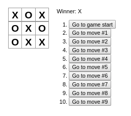

# tic-tac-toe

tic-tac-toe game built using react js

## Preview

(Diagram of tic-tac-toe game)

## Quick Start

In the project directory, you can run:

### `yarn start`

Runs the app in the development mode. 
Open [http://localhost:3000](http://localhost:3000) to view it in the browser.

The page will reload if you make edits. 
You will also see any lint errors in the console.
